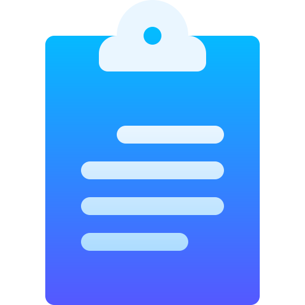
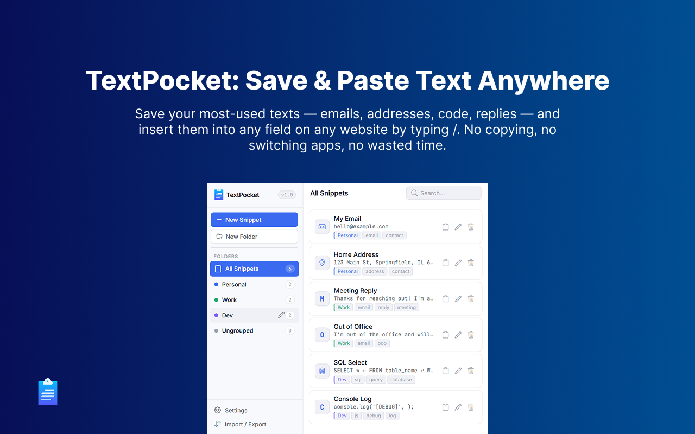
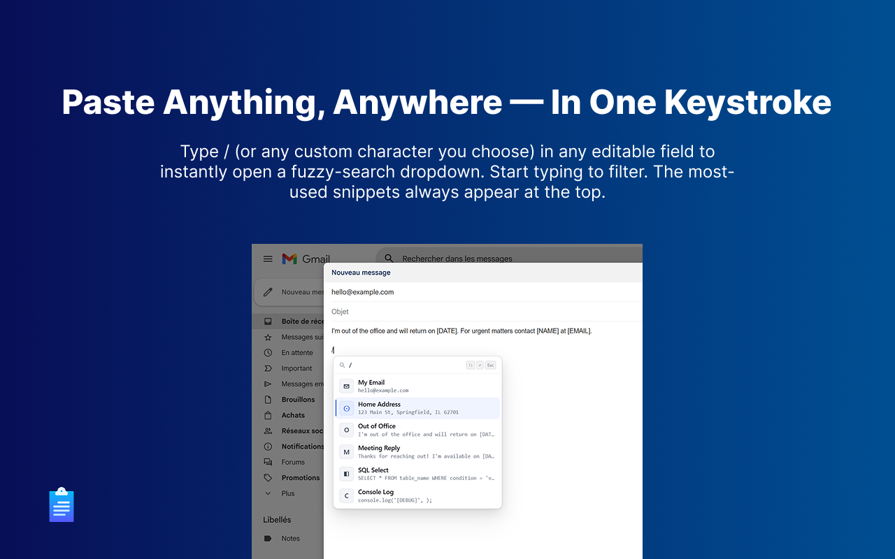
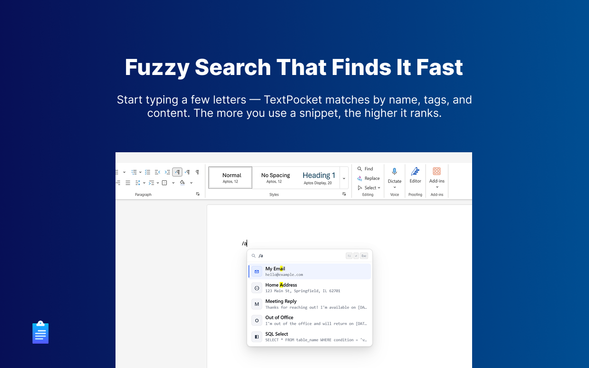
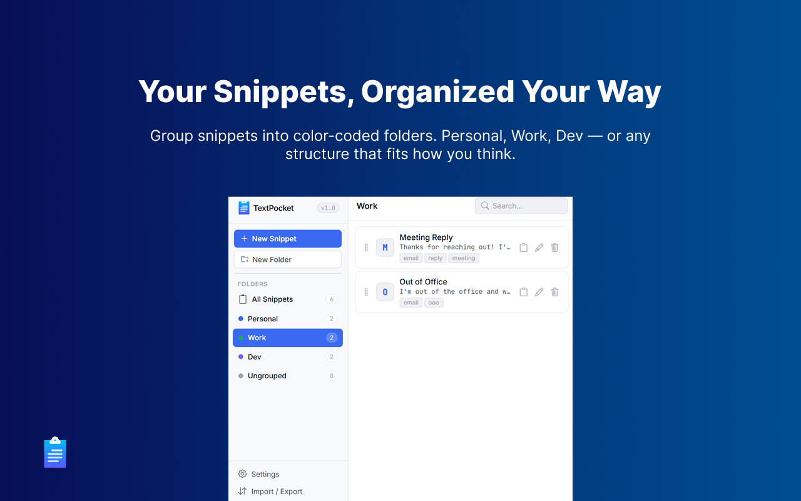
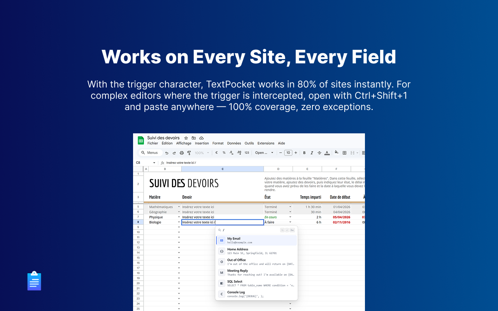
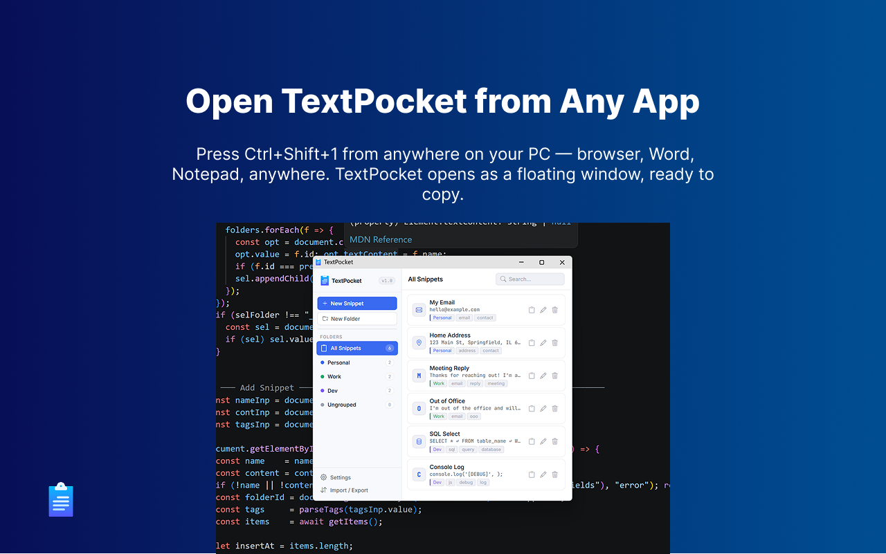
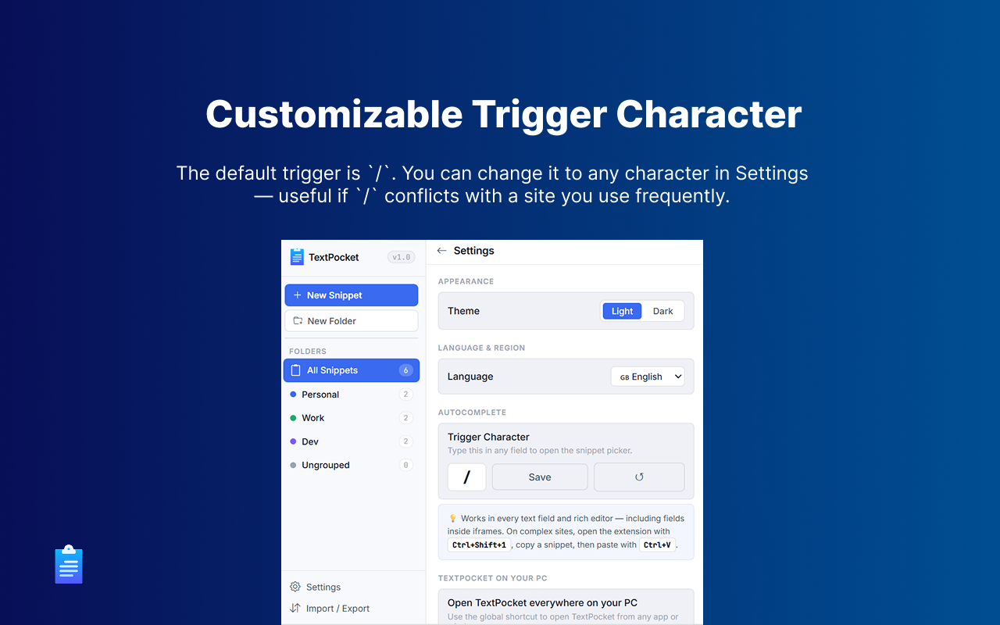
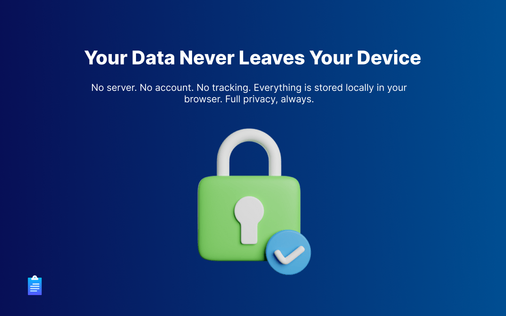

<div align="center">



# TextPocket

**Save text once. Paste it anywhere, instantly.**

A browser extension for Chrome and Edge that lets you build a personal library of text snippets — emails, addresses, code templates, replies, signatures — and insert them into any text field on any website with a single keystroke.

[](https://chrome.google.com/webstore)
[](https://microsoftedge.microsoft.com/addons)
[](LICENSE)
[](https://developer.chrome.com/docs/extensions/mv3/)

</div>

---


## Screenshots

  
  
  
  
  




---

## What is TextPocket?

TextPocket is a productivity extension that eliminates the friction of repetitive typing. Instead of copying from a notes app, digging through old emails, or re-typing the same phrases over and over, you type a single trigger character — `/` — in any text field and a smart search dropdown appears. Pick your snippet, press Enter, and it's inserted at your cursor.

It works **everywhere** — not just in your browser. You can open TextPocket from any application on your computer using a global keyboard shortcut, copy a snippet, and paste it wherever you need it.

---

## Features

### ⚡ Trigger Autocomplete
Type `/` (or any custom character you choose) in any editable field to instantly open a fuzzy-search dropdown. Start typing to filter. The most-used snippets always appear at the top.

- Works in `<input>`, `<textarea>`, and all `contentEditable` elements
- Works inside **iframes** — including embedded editors
- Fuzzy search powered by [Fuse.js](https://fusejs.io/) — finds your snippet even with typos
- Keyboard navigation: `↑` `↓` to move, `↵` or `Tab` to insert, `Esc` to close

### 📁 Folders & Organization
Organize snippets into color-coded folders (Personal, Work, Dev — or any structure you choose). Drag and drop to reorder within folders. Filter the popup by folder using the sidebar.

### 🔍 Smart Sorting
Snippets are ranked by how often you use them and when you last used them. The more you use a snippet, the higher it floats — the dropdown always shows your most relevant content first.

### 🌐 Open from Anywhere — Global Shortcut
Press **`Ctrl+Shift+1`** (Windows/Linux) or **`Cmd+Shift+1`** (Mac) from **any window on your computer** — not just the browser. TextPocket opens as a floating window instantly. Search for a snippet, copy it with one click, and paste it wherever you are.

> You can change this shortcut at any time in `chrome://extensions/shortcuts` or `edge://extensions/shortcuts`.

### ✏️ Customizable Trigger Character
The default trigger is `/`. You can change it to any character in Settings — useful if `/` conflicts with a site you use frequently.

### 🔃 Import / Export
Back up your entire snippet library as a single `.json` file and restore it anytime. Perfect for syncing across machines or sharing templates with a team.

### 🌍 Multilingual Interface
The popup UI is available in **English**, **French**, **Spanish**, and **Arabic** (including RTL layout support).

### 🌙 Dark Mode
Follows your system preference automatically. The popup and the autocomplete dropdown both fully support light and dark themes.

---

## Use Cases

| Who | How They Use It |
|-----|----------------|
| **Customer support agents** | Store canned replies, apology templates, escalation scripts — insert with one keystroke in any helpdesk |
| **Developers** | Keep SQL queries, `console.log` statements, boilerplate code, and regex patterns always at hand |
| **Sales & outreach** | Reuse personalized email intros, follow-up templates, and LinkedIn messages without copy-pasting from a doc |
| **Freelancers** | Store your address, bank details, invoice intros, and contract clauses to fill forms in seconds |
| **HR & recruiters** | Standardize job offer language, interview confirmations, and rejection emails across the team |
| **Writers & content creators** | Keep brand voice phrases, disclosure statements, social bios, and hashtag sets ready to insert anywhere |
| **Medical & legal professionals** | Store frequently used terminology, standard disclaimers, and form language |
| **Students & researchers** | Citations, bibliography templates, and email templates for professors |
| **Anyone who types the same things repeatedly** | Email addresses, phone numbers, home addresses, Wi-Fi passwords, meeting links |

---

## Supported Sites & Editors

TextPocket is designed to work on most websites and standard text inputs. It has been specifically tested and optimized for:

| Site | Works with trigger | Works with shortcut |
|------|--------------------|---------------------|
| Gmail | ✅ | ✅ |
| Microsoft Outlook Web | ✅ | ✅ |
| Microsoft Word Web | ✅ | ✅ |
| Microsoft Excel Web | ✅ | ✅ |
| Notion | ✅ | ✅ |
| ChatGPT | ✅ | ✅ |
| Claude | ✅ | ✅ |
| Google Gemini | ✅ | ✅ |
| Google Sheets | ✅| ✅ |
| Google Docs | ⚠️Partial | ✅ |
| Google Keep | ⚠️Partial| ✅ |
| Slack | ✅ | ✅ |
| LinkedIn | ⚠️Partial | ✅ |
| GitHub | ✅ | ✅ |
| Canva | ⚠️ Partial | ✅ |
| Any `<input>` / `<textarea>` | ✅ | ✅ |

> **Limitations:** TextPocket may not fully work on some advanced editors such as Google Docs, Google Keep, Canva, and LinkedIn due to their custom rendering systems (iframe, shadow DOM, or virtual editors).

> **Fallback:** In unsupported environments, use `Ctrl+Shift+1` to open TextPocket, search your snippet, copy it, and paste it manually with `Ctrl+V`.

---

## Privacy

TextPocket is built with a **privacy-first** architecture:

- **All data stays on your device.** Snippets, folders, and settings are stored exclusively in `chrome.storage.local` — your browser's local storage. Nothing is stored on any server.
- **No account required.** There is no sign-up, no login, and no user profile.
- **No network requests.** The extension makes zero outbound requests to any external server. It does not "phone home", send analytics, or collect any usage data.
- **No tracking.** TextPocket does not use cookies, fingerprinting, or any form of behavioral tracking.
- **Minimal permissions.** The extension only requests the permissions it actually needs:
  - `storage` — to save your snippets locally
  - `tabs` — to notify open tabs when you add or edit a snippet
  - `system.display` — To correctly center the TextPocket popup window on your screen when opened via the global shortcut.
  - `clipboardWrite` — To write snippet content before simulated paste, so the snippet is inserted correctly into the input fields or editors.
  - `clipboardRead` — Save and restore your clipboard around each paste.
  - `<all_urls> (Host Permission)` — Required to inject the autocomplete script into any website you visit, so the trigger character works across all sites. This does **not** mean the extension reads, stores, or transmits the content of those pages — it only activates when you type the trigger character in a field you are actively editing.

- **Open source.** The full source code is available in this repository. You can audit exactly what the extension does.
- **Content scripts are read-only.** The content script (`content.js`) only reads keyboard input in editable fields to detect the trigger character, and inserts text when you choose a snippet. It does not read, store, or transmit the contents of any page.

---

## Installation

### From the Web Store *(recommended)*
- **Chrome:** [Chrome Web Store →](#) *(Link will be added when published)*
- **Edge:** [Microsoft Edge Add-ons →](#) *(Link will be added when published)*


### Manual Installation (Developer Mode)
1. Download or clone this repository
2. Open `chrome://extensions` (or `edge://extensions`)
3. Enable **Developer mode** (top right toggle)
4. Click **Load unpacked**
5. Select this folder  **TextPocket**

---

## Getting Started

1. **Add your first snippet** — Click the TextPocket icon in your toolbar, then click **New Snippet**. Give it a name, add the text content, and optionally assign it to a folder.

2. **Use it anywhere** — Click into any text field on any website and type `/` (or your custom trigger). The dropdown appears. Start typing to search, use `↑↓` to navigate, and press `↵` to insert.

3. **Use it outside the browser** — Press `Ctrl+Shift+1` from any window on your computer. The TextPocket popup opens as a floating window. Search for a snippet, click **Copy**, switch to your app, and paste.

4. **Change the trigger** — If `/` conflicts with a site you use, go to **Settings → Autocomplete** and set a different trigger character (e.g. `;` or `=`).

5. **Organize** — Create folders for different contexts (Work, Personal, Dev). Drag snippets to reorder them within a folder.

---

## Keyboard Reference

| Action | Key |
|--------|-----|
| Open dropdown | Type `/` in any field |
| Navigate results | `↑` / `↓` |
| Insert snippet | `↵` or `Tab` |
| Close dropdown | `Esc` |
| Open TextPocket globally | `Ctrl+Shift+1` (Win/Linux) · `Cmd+Shift+1` (Mac) |

---

## Project Structure

```
textpocket/
├── manifest.json       # Extension manifest (Manifest V3)
├── background.js       # Service worker — seeds data, popup window
├── content.js          # Injected into all frames — trigger, dropdown, paste
├── popup.html          # Extension popup UI
├── popup.js            # Popup logic — CRUD, settings, import/export
├── assets/
│   ├── fuse.min.js     # Fuzzy search library
│   └── Sortable.min.js # Drag-and-drop reordering
├── lang/
│   ├── en.json         # English
│   ├── fr.json         # French
│   ├── es.json         # Spanish
│   └── ar.json         # Arabic
└── icons/
    ├── icon16.png
    ├── icon32.png
    ├── icon48.png
    └── icon128.png
```

---

## Contributing

Contributions are welcome. Please open an issue first to discuss what you'd like to change.

1. Fork the repository
2. Create a feature branch (`git checkout -b feature/my-feature`)
3. Make your changes
4. Test in Chrome and Edge with Developer mode
5. Open a pull request

---

## License

This project is licensed under the MIT License - see the [LICENSE](https://opensource.org/licenses/MIT) file for details.

---

<div align="center">
  <sub>Built for people who value their time.</sub>
</div>
